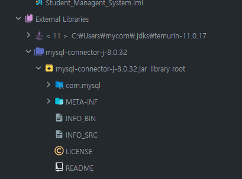
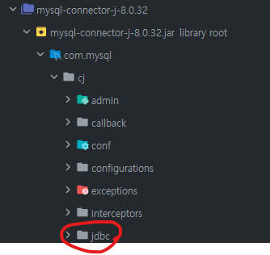

# 23.02.25 TIL
## Today Learned

### 첫 미니 프로젝트

미니 프로젝트를 하기 위해서 JDBC 연동을 먼저 해야 한다. 저번 학원에서 강의 프로젝트로는 mariaDB로 했지만 
이번에는 mySQL로 할 예정이다. mariaDB와 mySQL은 거의 같은데.. 그래도 mySQL로 해본다.

먼저, 인텔리제이와 연동을 해야 되는데 사실 연동부터 쉽지만은 않았다. 우선 mySQL을 설치를 다 하고 나면 자동으로
mySQL Command Line Client가구동이되는데 거기서 첫 비밀번호를 설정하여 DB에 들어갈 수 있었다. 기본적으로 users는 세 개 정도
생성이 되어 있는듯 했다. 나의 users 를 따로 만들어서 비밀번호도 설정 후 완료했다.

MySQL workbench 도 있긴 했는데..이 툴은 익숙지 않아서 인텔리제이에서 지원하는 DataGrip 을 사용하기로 했다. workbench는 나중에
DB가 좀 더 익숙해지면 다시 한번 시도해볼 예정이다.

DataGrip에 들어가 해당 포트(3306인데 어디 포트가 중복이 되나본지 나는 3305로 지정했다.)와 계정 명, 비밀번호 등 입력하여 연동테스트도 마쳤으며
테스트용 테이블과 컬럼 등.. 넣어놨다. 

이제 인텔리제이로 돌아와 이것들을 연동을 해야 하는데, 여기서부터가 핵심이지 않았나 싶다.

적당한 프로젝트(나한테는 있어서 미니 프로젝트)를 지정해, 외부 라이브러리와 연결을 시켜야 했다. File -> Project structure에 들어가
라이브러리를 선택한 후 내가 받아온 MySQL .jar 파일을 추가했다. 



그 결과로 Connector로 잘 들어온 상태이다. 그리고 우측 상단에 Database 카테고리가 있는데 그것을 클릭해 DataGrip에서 연동했듯이
똑같이 연동해주면 끝이다. 

간단하게 연동 테스트를 해보자면 !

```java
import java.sql.*;

public class SqlTest {
    public static void main(String[] args) throws SQLException {

        String url = "jdbc:mysql://localhost:3305/JDBC_TEST";
        String user_name = "root";
        String password = "1111";

        /**
         * Class.forName(com.mysql.cj.jdbc.Driver"); <- Driver Load
         * JDK1.6(JDBC4) 부터는 getConnection 할 시에 Driver가 자동 로드됨. 나는 11이라 밑에 로직대로 실행하면 로드되는 것.
         * forName 안 써도 된다는 것임.
         * 간단해서 좋은듯.
         */

        Connection conn = DriverManager.getConnection(url, user_name, password);

        Statement st = conn.createStatement(); // Statement 객체 생성 입력하기 위해서

        ResultSet rs = st.executeQuery("select * from member"); // 출력문 작성 그것을 rs 객체에 저장

        while (rs.next()) {
            String id = rs.getString("id");
            String phone_number = rs.getString("phone_number");
            String address = rs.getString("address");
            String name = rs.getString("name");
            System.out.println( id +"/"+  name +"/"+  phone_number +"/"+  address);
        }

        rs.close();
        st.close();
        conn.close();

    }
}
```

먼저 결과에 대해 이야기하기 전에 주석처리한 부분을 살펴보자면, 나는 강의 때 들었던 내용으로는 Class.forName 함수를 사용해 
try catch 문법으로 Class.forName("org.mariadb.jdbc.Driver"); 를 처리했었다. 그렇기에 똑같이 Class.forName("com.mysql.jdbc.Driver");라고 입력 후

run을 눌러 보면... 
```
Loading class `com.mysql.jdbc.Driver'. This is deprecated. The new driver class is `com.mysql.cj.jdbc.Driver'. The driver is automatically registered via the SPI and manual loading of the driver class is generally unnecessary.
```
이런 에러가 나오면서 실행이 되질 않았다. 구글링하여 찾아본 결과  com.mysql.jdbc.Driver 은 예전 버전이라 안 되고, com.mysql.cj.jdbc.Driver을 사용하면 되겠다 라는 문구였다.

그래서 해당 로직으로 변경하여 다시 run 해본 결과...............

```
S110528/우상훈/01011112222/나의주소
```

성공 !!!!

실제로 보니



cj 디렉토리 안에 들어가 있던 것을 확인할 수 있었다. 연동까지 무사히 마쳤으니, 이제부터 나만의 미니 프로젝트를 하나 만들어 봐야겠다.
Java와 JDBC를 활용하여 학생관리시스템을 만들어볼 예정이다.

일단은 아주 기본적인 이 시스템의 회원가입, 회원조회, 회원수정, 회원삭제인 CRUD부터 구현해나갈 예정이다. 나만의 첫 프로젝트라 잘 안될 수도 있지만
그래도 도전해보자!! 스프링까지 배운 상태이지만 그래도.. 기본적인 Java와 JDBC를 이용하여 최대한 만들어보고 그 다음에 스프링 BOOT를 사용하여

다른 프로젝트를 만들어보던지, 아니면 기존의 프로젝트를 업그레이드 하던지 해보고 싶기 때문에.. 아직은 스프링을 이용한 프로젝트는 만들지 않을 것이다.


간단하게 CRUD를 구현했다. 자세한 내용은 링크를 걸어둘 것이다! [CRUD](https://github.com/yeb0/Student_Managent_System)

## 느낀 점?
첫 미니프로젝트라 그런지 처음엔 막막했는데, 하다 보니 배운 것들이 생각나 나만의 것으로 쓰기 위해 생각을 좀 해봤던 거 같아서 좋았다.
실제로 작동이 잘 되어 기분이 되게 좋았음. 지금.. 작성하고 있는 게 시간이 얼마 없어서 자세히는 적지 못하나, 시간이 되면 다시 이 TIL 수정할 예정이다.
## 내일 할 일? 

오늘은 스프링을 못 듣고 미니 프로젝트를 하느라 시간을 다 썼기에 마지막 기본 SPRING 강의를 듣고, OS 공부를 좀 할 예정이다. 마침
OS 스터디도 있어서 꼭 챙겨 봐야한다. 이번주 OS 스터디의 주제는 교착상태이기에 조금 더 깊이 알아볼 필요가 있을 것이다.