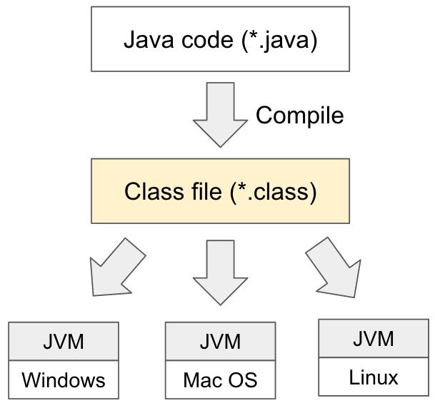
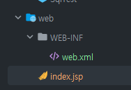
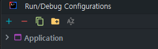
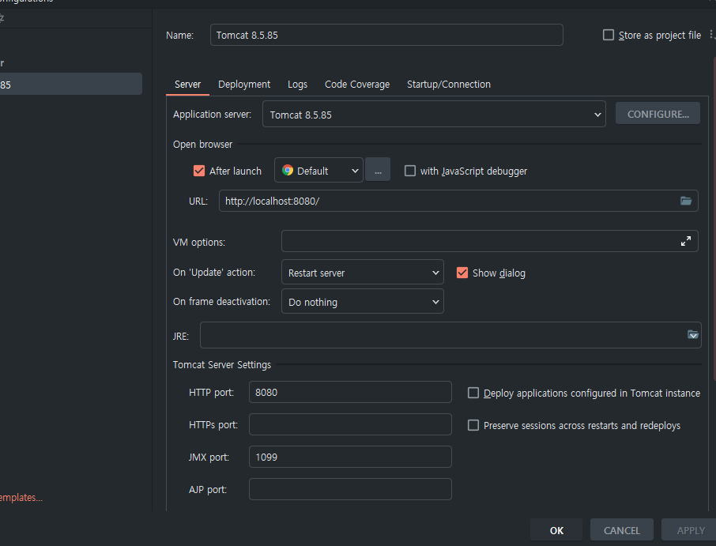
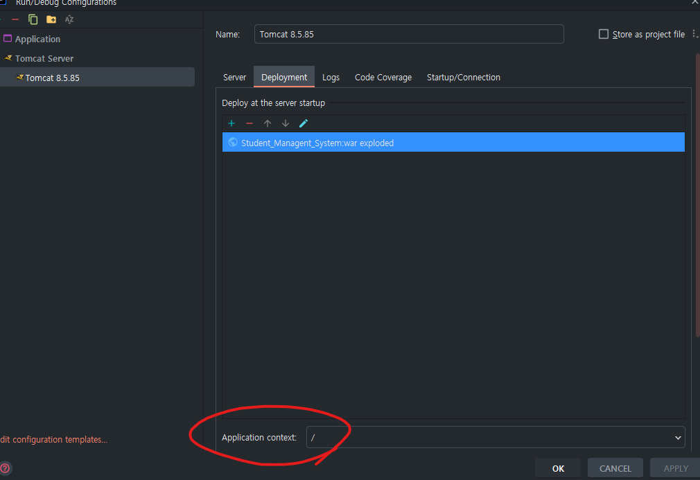
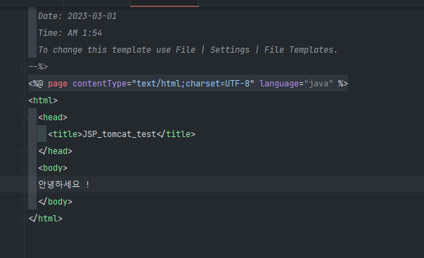
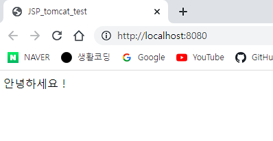
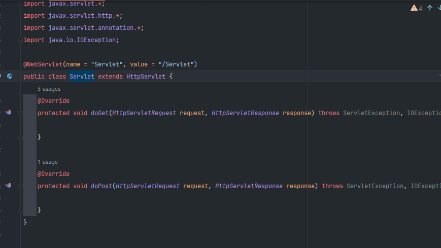

# 23.03.01 TIL
## Today Learned

## HTTP 강의 시작, 그런데 이제 MVC도 곁들인

HTTP 강의는 이론 위주의 강의라서, 이것은 쉬는 시간이나 짬 날 때마다 틈틈이 보면서 공부하려고 한다. 그래서 MVC를 먼저 시작한다 !

강의를 보는데, jsp와 servlet 은 되게 오래전에 나왔던..기술..?이었다. 타임리프를 공부하는 것을 추천해주셨는데, 그래도 강의에 있듯이 
servlet과 jsp가 어떤 건지 정도는  같이 실습을 따라 치면서 배우는 것이 중요한 거 같다. 마침 내 프로젝트에서도 톰캣 직접 연결과 jsp, servlet도 써 볼 테니
좋은 기회이지 않나 싶어서 듣는 것이 마땅하다. 

그래도 개발자인데 알아야 된다고 생각하기에.. servlet을 이용한 강의 프로젝트를 시작해보자.(저번과 마찬가지로 코드는 저작권 상 문제가 있기에)
학습한 내용을 구두나 글로 설명할 수밖에 없을 거 같음. 코드는 X


## GC (JVM)?
어제 GC를 공부하다 JVM 파트가 나와 JVM에 대해서 알아보려고 한다.

JVM ? 

Java Virtual Machine : 

자바 가상 머신으로  자바 바이트 코드를 실행할 수 있다. CPU나 OS의 종류와 무관하게 실행이 가능함.

즉, **OS 위에 동작하는 프로세스로 Java 코드를 complie해서 얻은 바이트 코드를 OS가 볼 수 있는 기계어로 바꿔 실행시키는 역할**을 한다.



JVM은 OS로부터 메모리를 할당 후 자바 컴파일러(javac)가 소스코드(.java)를 자바 바이트코드(.class)로 컴파일한다.
저기 있는 그 소스코드 .java 파일이 내가 평소에 클래스를 만들고 하면 나오던 그 파일임. 그것이 class로 컴파일되는 것.

**ClassLoader**를 통해 JVM **Runtime Data Area**로 이동하게 된다. Runtime Data Area로 로딩 된 .class 파일들은 Execution Engine을 통해 해석한다.

그렇게 해석된 바이트 코드는 Runtime Data Area의 각 영역에 배치 되어 수행하며 이 과정에서 **Execution Engine**에 의해 GC 작동과 스레드 동기화가 이루어지는 것.


### 1.ClassLoader ?
* Hello.java -> Hello.class로 변환함. 이 .class 파일을 바이트 코드라 부름. 그래서 이렇게 생성된 파일들을 엮어 JVM이 OS로부터 할당받은
메모리 영역인 Runtime Data Area로 적재하는 역할을 클래스로더가 한다.

### 2. Execution Engine
* 그래서 이 파일들이  Runtime Data Area 로 배치되는데 자세히는 Method Area로 배치됨. 그 이후에 JVM은 Method Area의 바이트 코드를 실행엔진에 제공하여
정의된 내용대로 바이트 코드를 실행한다. **이때 로드된 바이트코드를 실행하는 런타임 모듈이 실행 엔진(Execution Engine)**이다.

### 3. Garbage Collector
* GC는 [어제](https://github.com/yeb0/TIL/blob/main/23.02/02.28.md) 조금 정리한 내용을 찾아보면 될 것 같다. 여기에 추가적으로,
Full GC가 일어나서 모든 스레드가 정지된다면 에러가 나는 치명적인 문제가 일어날 수 있음.


### 4. Runtime Data Area
* JVM의 메모리 영역으로, 위에서 이야기했듯이 애플리케이션을 실행할 때 사용되는 데이터들을 적재함. 여기서 Method Area, Heap Area, Stack Area, PC register, Native Method Stack으로 나뉘고, Heap인 이곳에 몇 가지 영역으로 또 나뉘는데 이것도 어제 언급했듯이
Eden, survivor1, 2, Old, Permanent(non-heap)임.

***
### 1. Method Area
* 클래스 멤버변수의 이름, 데이터 타입, 전근 제어자 정보와 같은 각종 필드 정보들과 메서드 정보, 데이터 Type 정보, Constant Pool, static 변수,  final class 등이 생성되는 영역.

### 2. Heap Area
* new 로 생성된 객체와 배열이 생성되는 영역
* 주기적으로 GC가 제거하는 영역이다. 이 부분을 이제 집중적으로 공부할 것이다. (GC에 관하여)

### 3. Stack Area
* 지역변수, 매개변수, 리턴 값, 연산에 사용되는 임시 값 등이 생성되는 영역

### 4. PC register
* Thread가 생성될 때마다 생성되는 영역. 프로그램 카운터... 즉 현재 Thread가 실행되는 부분의 주소ㅗ아 명령을 저장하고 있는 영역.

### 5. Native Method Stack
* Java 이외의 언어(C, C++..)로 작성된 네이티브 코드를 실행할 때 사용되는 메모리 영역.
* 보통 저 이 외의 언어들의 코드를 수행하기 위한 스택을 말한다. **Java 컴파일러에 의해 변환된 자바 바이트 코드를 읽고 해석하는 역할을 하는 것이 바로 자바 인터프리터(interpreter)이다**.

내일부터 이제 GC - Heap 영역에 대해 공부할 예정이다.

## 프로젝트(~ing)

웹에 연결하기 위해 인텔리제이로 연동하려고 한다. 저번엔 과제로 이클립스로 진행했기에 해당 강의만 따라가면 돼서..
큰 어려움이 없었으나 내가 직접하려고 하니 이게 또 ..새로운 느낌이었다. 우선, 알아본 결과 Servlet과 JSP가 있었는데..
JSP는 많이 들어봤지만 Servlet은 어디서 조금씩..? 들어본 정도. 그래서 둘의 차이와 개념을 간단하게 알아봤다. 해당 글을 읽고
어느정도 감이 잡혔다. [Servlet과 JSP](https://gmlwjd9405.github.io/2018/11/04/servlet-vs-jsp.html)🙇‍♂️

### Servlet ?

* 웹 기반의 요청에 대한 동적인 처리가 가능한 Server Side에서 돌아가는 Java Program
* Java 코드 안에 HTML 코드 (하나의 클래스)
* 웹 개발을 위해 만든 표준

### JSP ?
* Java 언어를 기반으로 하는 Server Side 스크립트 언어
* HTML 코드 안에 Java 코드 
* Servlet을 보완하고 기술을 확장한 스크립트 방식 표준
* All features of Servlet + Implicit object, predefined tags, expression language, custom tags (Servlet의 모든 기능 + 추가 기능)

### 이 둘의 차이?

먼저 Servlet은 data processing(Controller)에 좋다. 즉, DB와의 통신, Business Logih 호출, data를 읽고 확인하는 작업 등 유용하다. Servlet이 수정된 경우 Java코드를 컴파일(.class생성)한 후 동적인 페이지를
처리하기 때문에 전체 코드를 없데이트하고 다시 컴파일한 후 재배포해야함.(생산성 down)

그에 비해 JSP는 presentation(View)에 좋다. 즉 요청 결과를 나타내는 HTML 작성하는 데 유용함. JSP가 수정된 경우 재배포할 필요가 없이 WAS가 알아서 처리하기에 생산성은 높고 쉽다.

차이라곤 하나, 그렇다고 JSP만 사용하냐, Servlet만 사용하냐는 아니었다. 하나만 사용해도 되고, 둘 다 사용하는 케이스도 있기에 새로 배워간다.음.. 그러면 내 프로젝트에선 둘 다  사용을 해야되는지..? 싶다.

우선 프로젝트 우클릭 후 Add Framework Support를 눌러 Web Application을 추가해줬다. xml 파일은 혹시 몰라 같이 추가해줬다.



잘 나온 모습.! 이제 저 jsp 파일로 톰캣을 이용해 웹에 연결할 수 있을 것이다.

우선 Spring이 아니기에 tomcat은 내장되어있지 않아서 설정해줘야만 한다. 우측 상단의 Add Configuration or Edit configuration을 눌러서



+버튼을 눌러준 후에 Tomcat server을 찾아 추가해줬다. 나는 전에 강의로 프로젝트를 하나 만들면서 tomcat을 따로 설치한 적이 있기에 해당 tomcat으로 지정해줬다.



포트는 기본인 8080 포트로 지정해주고, 내가 많이 쓰는 웹 브라우저로 크롬을 선택했다.



밑에 있는 Application context를 기본으로 '/'를 써서 https://localhost:8080/ 이 기본이 되게끔 해주고 싶어서 지정했다.
만일 지정해주지 않는다면, https://localhost:8080/프로젝트명/ 이런 식으로 url이 지정되기에 나는 main으로 따로 비워주는 식으로 했다.

다 설정을 끝냈으니 이제 실행을 해 보면 ?




웹 타이틀 제목으론 JSP_tomcat_test가 나와야 할 것이고, 내용으론 안녕하세요 ! 라는 문구가 보여야 성공이다.



깔끔하게 성공!!!!

추가적으로 servlet도 해줬다.



이제 연동도 잘 되는 모습을 확인했으니 로그인페이지부터 만들어보자~~!

### 알고리즘

```java
package Programmers;

import java.util.HashSet;
import java.util.Iterator;

/**
 * 에라토스테네스의 체는 간단하다. 예를 들어 71이라는 숫자가 소수인지 판별하고 싶다면 보통
 * 2의 배수, 3, 4, 5... 70배수까지 있는지 확인 후 없다면 1, 71이기에 소수인 것을 알 수 있지만 여기까지 안 가도 된다.
 * 71에 루트를 씌운 수까지 가면 된다는 이야기이다. 71이니 8의 배수까지만 확인해보면 답이 소수판별이 가능한 것이 이 공식이다.
 */
public class Test28 {
    public static void main(String[] args) {
        Test28 test = new Test28();
        System.out.println(test.solution("17"));
    }
    public int solution(String numbers) {
        int answer = 0;
        // 1. 모든 조합의 숫자를 만들기.
        recursive("", numbers);
//        System.out.println(numberSet); 잘 들어가있는지 확인차 출력문

        // 2. 소수의 개수 count
        // iterator ? 반복자
        // numberSet이라는 애가 실체인데, iterator 라는 인터페이스를 쓰는 것. hasNext(), next(), remove()가 있음
        // for문 써도 되는데 안 쓰는 이유는 이것은 list든, ArrayList든, 어떠한 자료구조든 동일한 조건으로 사용이 가능하기에 채용
        Iterator<Integer> it = numberSet.iterator();
        while (it.hasNext()) { // 다음의 것이 있는 가?
            int number = it.next(); // 있으면 하나씩 꺼내와서 동작
            if (isPrime(number)) {
                answer++;
            }
        }
        // 3. 소수의 개수 return
        return answer;
    }
    HashSet<Integer> numberSet = new HashSet<>();

    /**
     * 재귀함수는 이것만 기억하자.
     * 1. 이 조합으로 뭘 할지 ?
     * 2. 다음 조합은 어떤 것을 넘겨줄지 ?
     */
    public void recursive(String comb, String others) { // comb = 여태까지 조합한 숫자를 의미, others = 여태까지 쓰질 않을 숫자
        // 1. 현재 조합을 set 에 추가하기. (set은 중복제거라서 11 이라는 숫자가 있으면 1이 아닌 2가 카운트 되는 것을 방지)
        if (!comb.equals("")) {
            numberSet.add(Integer.valueOf(comb));
        }
        // 2. 남은 숫자 중 하나를 더 해 새로운 조합을 만들기.
        for (int i = 0; i < others.length(); i++) {
            // 0 번째부터 i번째까지 subString + i + 1번째에 subString을 떼와서 붙이면
            // i 번째에 있는 그 숫자 빼고는 나머지를 보존해서 다음 순서에 또 더할 수 있을 것임.
            recursive(comb + others.charAt(i), others.substring(0, i) + others.substring(i + 1));
        }
    }

    public boolean isPrime(int num) {
        // 1. 0과 1은 소수가 X
        if (num == 0 || num == 1) {
            return false;
        }
        // 2. 에라토스테네스의 체의 limit을 계산한다. (루트 씌우기)
        int lim = (int)Math.sqrt(num);
        // 3. 에라토스테네스의 체에 따라 limit까지만 배수 여부를 확인
        for (int i = 2; i < lim; i++) {
            if (num % i == 0) {
                return false;
            }
        }
        return true;
    }
}
```

이 문제에서 핵심은 재귀함수와 에라토스테네스의 체 정리였다. 또한 Iterator는 어떨 때 사용하는 것이 좋은지에 대해서도 생각해볼만 하다.
구현 생각은 완벽하게 똑같았으나, 구현이 잘 되질 못해 풀지 못했지만 단위로 쪼개면서 하나씩 코드를 보니 어느새 이해를 하고 있는 내가 보였다.

재귀는 어려운 것 같다. 주석으로 처리한 것처럼 이 조합으로 뭘 하고 다음엔 어떤 것을 넘겨줄지만 정확하게 생각하고 있다면 재귀함수는 금방 익힐 수 있을 거 같다.
자료구조로 해시를 또 사용하게 됐는데, 해시를 완벽하게 이해하고 다른 곳에서도 유용하게 사용할 줄 알아야겠다는 생각이 든 문제다.


## 느낀 점 ?

servlet과 jsp... 명확하게 잘 알고 간다는 아니지만 그래도 추상적인 개념은 알아냈다. 이것도 직접 써 보고 많이 보면은
익숙해지면서 잘 사용할 수 있지 않을까 싶다. 아직까진 조금 버벅이기도 하고 어려운데 괜찮다! 마냥 이런 연동은 이클립스로만 했어서

좋은 인텔리제이를 두고 이클립스를 써야하나 싶었지만 역시..찾다보면 방법은 나온다..ㅜㅜ
내 웹서버가 띄워질 때마다 당연히 나와야하는 거지만.. 나오는 거겠지만, 잘 나오는 모습을 보면 기분이 괜히 좋다. 성취감일지..


알고리즘을 그냥 해시만 죽어라 파보고, 다 풀어봤다면 다른 알고리즘으로 넘어가보고.. 그런 식으로 공부를 해볼까 생각 중이다.
그래서 지금은 해시만 죽어라 공부해볼..예정..

## 내일 할 일 ?
Spring MVC, GC(Heap), 알고리즘, 프로젝트...(시간이 난다면 OS책과 CS강의정도)