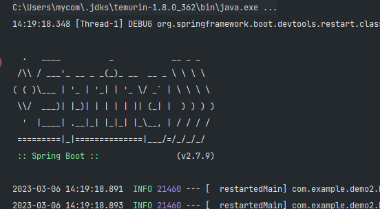
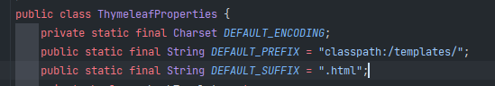
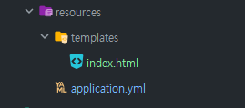

# 23.03.06 TIL
## Today Learned

강의를 따라 프로젝트를 생성하려고 하니.. 아주 범잡을 수 없는 에러를 마주하게 됐는데,

```
오류: 기본 클래스 com.example.""을(를) 찾거나 로드할 수 없습니다.
```

이런 에러를 뿜는다. 어디 구글링 해서 잠깐 봤던 결과, 그냥 재실행하면 됐다는 분들도 계셔서
나도 혹시란 마음에 재실행 해봤으나, 똑같은 에러였다. 메인에서 실행하지 않고 따로 메서드로 실행했을 결과

```
Internal error (java.io.IOException): Cannot find IntelliJ IDEA project files at C...
```

대충 찾을 수 없다는 내용인 거 같은데 왜 찾을 수 없는지 이해가 안 됐다.. 강사님은 오른쪽 상단 부분 툴에
maven 을 눌러서 clear과 package를 누르시곤 다시 재빌드를 하시는 거 같았는데, (maven이 다 안 받아져서)
영상에선 잘 됐지만, 나는 잘 되지 않았다..ㅠㅠㅠ

구글링을 통해 알아봤던 건 Run/Debug Configuration 부분이 잘못됐다는 글들이 많았는데, Main class를 변경한 클래스명과 동일하게 수정한다던지 ?
아니면 환경변수이슈로 실행이 안 된다던지.. Project Structure로 들어가 Project Settings -> Modules 선택하여 main과 test를 삭제한다던지..

굉장히 많았지만 다 해봤으나 다 똑같았다.. 정말 강의 하는 대로 그대로 똑같이 따라하고 똑같이 했는데 왜 안 되나 하루를 넘겨 
계속 생각해봤는데.. 혹시?????? 하는 마음에 해당 프로젝트가 들어갈 디렉토리 명을 영문으로 바꾸고 다시 프로젝트를 만들어

실행해보니..??



와.............................😭😭😭😭😭😭😭😭

한글로 만들어져 있던 게 인식을 못해서 인텔리제이가 못찾은 거 같은데, 근데 여기서 이상한 점은..
여태 다른 폴더들은 인식 잘만 하고 잘 됐는데 왜 이것만 안 되는지 그게 참 의문이었다.

그리고 추가적으로 찾아봤던 해결 방법 중 [이 방법](https://stackoverflow.com/questions/69956907/cannot-find-intellij-idea-project-files)이 있었는데
굉장히 나와 유사했다. 거기에 있는 댓글을 인용해보자면,

>폴더 이름의 iffy 인코딩이 부분적으로 의심됩니다./ЕП/ –
>
> 
>공백이나 인코딩 없이 폴더 이름을 바꿀 수 있습니까?
> 
>덕분에 해결되었습니다. 나는 키릴 문자를 사용했는데 그것이 문제였습니다 .


인코딩이 잘못되어 그렇다는데, 결국 나의 문제인 한글을 인식 못해 찾질 못했다는 이슈와 동일한 거 같다.
허나 해결된 건 둘째치고.. 다른 프로젝트들은 잘 작동하는데 왜 이것만 찾지 못하는지..그게 정말..너무 궁금하다.

JDK나 Java 버전의 문제인가? 싶다. JDK는 1.8버전이며, Java는 8로 사용했다. 혹시나 나중에
이와 같은 문제가 생길 경우 디렉토리 명을 다시 한 번 생각해볼 필요가 있다...(아님 환경변수라던지)

+++

@Controller 와 @RestController의 차이점을 간단하게 배웠다. 아마 깊이있게 배우면 조금 더 어려울 텐데 그것은 나중에
기반부터 잡아놓고 공부할 예정이다.

```java
    /**
     * class에 Controller를 했을 때 해당 메서드가 오류가 나는 이유 ?
     * maven기준, pom 파일 가보면..
     *
     * <dependency>
     *             <groupId>org.springframework.boot</groupId>
     *             <artifactId>spring-boot-starter-thymeleaf</artifactId>
     *</dependency>
     * 를 의존했는데, 타임리프를 쓰는 것은.. 우리가 예상했던 값은
     * http://localhost:8080/
     * 을 들어가면 index 라는 텍스트가 찍혀야 하는데 안 찍힌다. 그 이유는? 타임리프가 return "index";를
     * index라는 파일을 찾아서 리턴해야 하는데 그런 파일이 없기에 오류를 뿜는 것.
     */
    @RequestMapping("/")
    public String index() {
        return "index";
    }
```

기본적으로 참조하는 값은 


templates 밑의 html 파일을 참조하기에



resources 밑에 templates를 만들고 해당 html을 만들면.. 그 파일로 참조하게 되는 것이다 !!!

application 파일에서 (확장자를 yml로 바꾼 상태, 초기엔 아무것도 없는 상태임) 

spring:
thymeleaf:
suffix: .html
prefix: classpath:/templates/

를 입력해 suffix를 jsp로 바꾸고 확장자도 동일하게 해주면 똑같이 작동하는 모습을 볼 수 있다.
설정하는 거라 보면 될 거 같다.

html.. required 을 붙여주면 해당 입력란은 꼭 입력해야 넘어갈 수 있게 만들 수 있음.

type은 말 그대로 type. 어떤 type인지? email이다 싶으면 @ 을 안 붙이면 @ 붙이라고 해당 알림이 뜸.
여러 속성들이 있으니 참조할 것.

